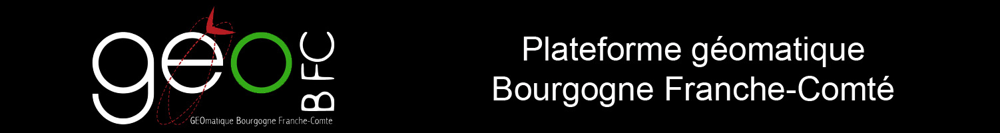
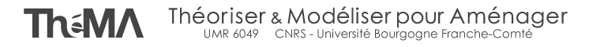

GeoSync was originally created in 2015 by Alexandre Maindron and Martin Tovmassian.

    Alexandre MAINDRON <alexandre@exmackina.com>
    Martin TOVMASSIAN <martin.tovmassian@gmail.com>

The code is currently written and maintened by Sophie Mollard.

    Sophie MOLLARD <sophie.mollard@univ-fcomte.fr>

Ernest Chiarello is the project manager ; he is member of the research laboratory [ThéMA](http://thema.univ-fcomte.fr/).

    Ernest CHIARELLO <ernest.chiarello@univ-fcomte.fr>

The project is funded by the [MSHE of Besançon](http://mshe.univ-fcomte.fr), USR3124 "CNRS - University of Franche Comte".

